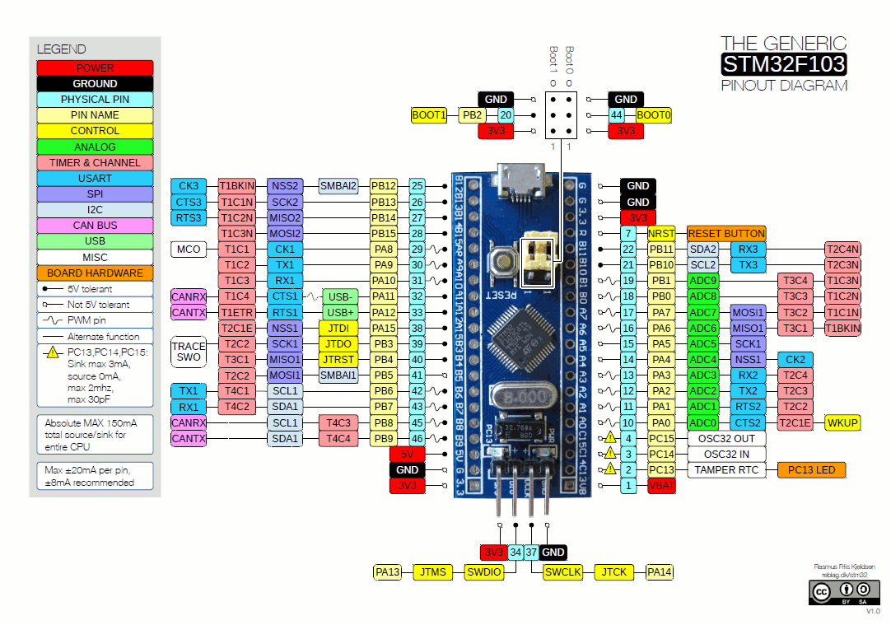
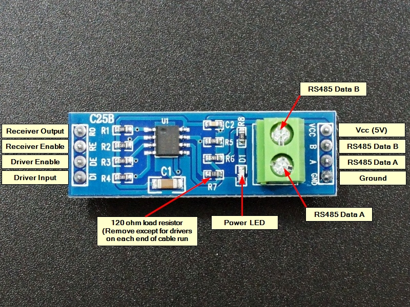
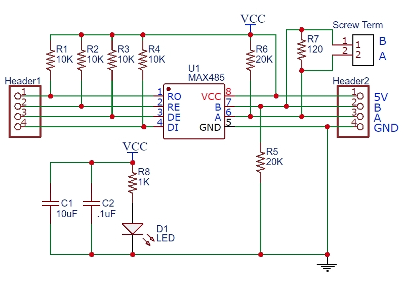
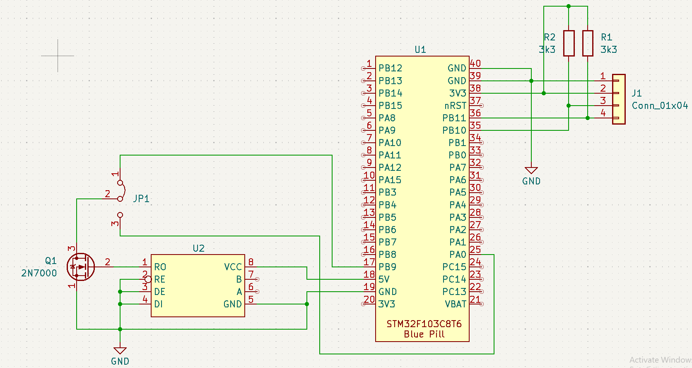
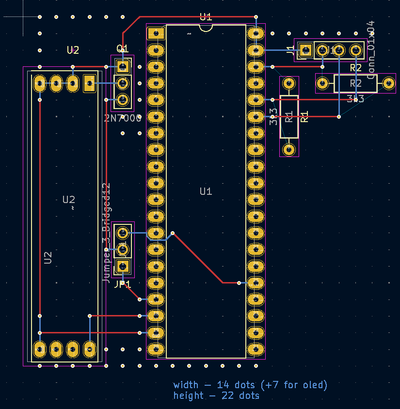
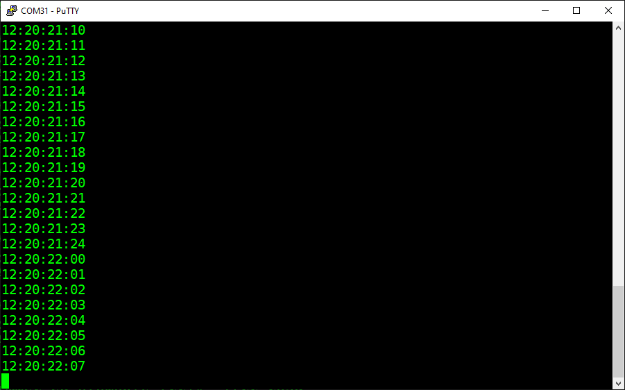
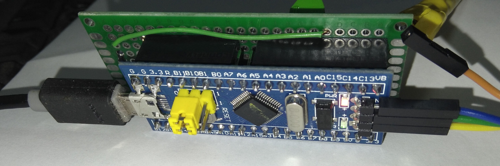
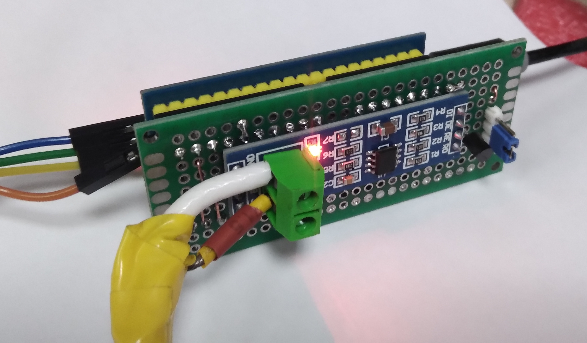

# stm32_ltc_decoder

This device used for decoding LTC from VTRs or other sources. Output sent to CDC serial.

## used parts

### STM32 BluePill board

### RS485 module

Note: **R7** should be removed

### other
* 2N7000
* Jumper
* Prototyping PCB

## connection diagram

## output example

## working model

## notes

